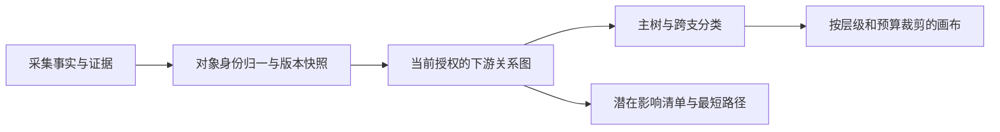

# 血缘模型与算法设计

> v1.0 更新：本文保留产品/领域/架构与验收背景。已收敛的技术栈、环降级字段、数据导入页面、查询协议和默认决策统一以 [完整实现设计](07-implementation-design.md) 为准；接口字段以 `spec/v1/openapi.json` 为准。早期“待确认”条目不阻止按明确默认值完成本地编码，真实数据/SSO/目标环境仍需独立验收。

## 1. 三层模型

事实层保留真实关系；查询层执行权限、根和 Java 终点规则；展示层负责分类、布局及折叠。不同根、版本和权限下，同一条事实边可以属于不同展示分类，不能把 tree/cross 永久写成关系本身的固有属性。

## 2. 对象与身份

| 字段 | 设计含义 |
|---|---|
| objectId | 不透明稳定 ID；不以显示名直接作主键 |
| type | table / view / procedure / java |
| namespace | 环境、系统、数据源实例、库、schema 或代码仓库/模块的分层定位 |
| technicalName / displayName | 原技术名及中文名；中文名缺失允许回退，不伪造 |
| ownerRef / systemRef | 可解析的负责人/团队和系统标识；展示名可变 |
| sourceLocator | 表的限定名，或代码库、版本、文件/符号位置；受权限约束 |
| lifecycle | active / deleted / unknown；仅对对应快照成立 |

环境是身份的一部分，不能把测试和生产同名表合并。Java 粒度待确认，V1 建议以“类/作业/服务中一种明确单位”为主并记录 `javaKind`，不能一份清单里把类和整个系统当作同等程序数量。

表或符号重命名：来源若有稳定标识则沿用 objectId；无法证明同一对象时保留两个对象及人工映射候选，不仅凭相似名字自动合并。

## 3. 关系方向必须统一

地图箭头定义为“从被依赖对象/生产环节指向下游使用者/产物”的查询方向。原始关系需要记录主语和宾语，避免 reads 文案反转。

| 原始事实 | 查询边 | 详情文案 |
|---|---|---|
| P 读取 T | T → P，reads | P 读取 T |
| P 写入 T | P → T，writes | P 写入 T |
| B 由 A 派生 | A → B，derives | B 由 A 派生 |
| P 调用 Q | P → Q，calls | P 调用 Q |

calls 表示调用可达，不能自动断言当前表的数据一定传入 Q；reads 与 writes 也不证明某次运行一定执行。V1 采用对象级潜在关联并说明此限制。若未来需要精确数据传播，必须增加参数、字段或运行证据，不能静默升级结论强度。

建议 Relation 字段：`relationId, sourceId, targetId, rel, sourceFactId, evidenceIds, evidenceState, observedAt, validFrom, validTo`。证据状态属于边：`observed / parsed / inferred / confirmed / unknown`；这些是来源/审核状态，不用百分数伪装可信度。节点的旧 `verified` 状态不能证明它的每条边已被验证。

相同端点、相同关系可合并为一个逻辑关系，合并后保留多条证据。不同 rel 并存必须保留独立 relationId；每节点只选一个 relationId 作为主父边。

## 4. Java 终点规则

查询构图时停止沿 Java 的出边继续遍历；Java 本身仍计入可达集合。不能删除事实库中的 Java 写表或调用关系，也不能为使树好看而改写成存储过程写表。

页面文案：“本地图在 Java 程序处停止展开。”Java 可出现在任意展示层级，不要求把所有 Java 移到统一最右列；非 Java 也可以是无后继叶子。`javaTerminalCount` 与 `leafCount` 分别定义。

## 5. 计算顺序与不变量

1. 固定快照、根和算法版本，验证根是合法且可查看的表。
2. 身份解析、端点校验、关系类型校验、同事实去重；异常进入质量报告。
3. 在服务端过滤未授权对象及其关联边。不得先经过隐藏中间节点遍历，再只从响应删除该节点。
4. 在展示输入中移除 Java 出边和自环；保留处理原因。自环必须在计算入度前移除。
5. 按合法有向边 BFS 计算可达集合及 `minHops`。树层级参数不会限制这一完整范围计算；另有查询总预算。
6. 检测有向环。无环则拓扑排序计算最长 `layoutRank` 与主父；有环走第 7 节降级策略。
7. 以选中的 relationId 精确划分 tree/cross，计算唯一 children 和全范围统计。
8. 最后应用类型呈现、展开集合、列内分页和渲染预算。

无环且计算完整时的验收不变量：根无父；所有非根可达对象恰有一条主父边；主边数量=可达节点数−1；tree/cross 无交集且覆盖全部合法关系；所有响应边端点都在该响应或约定已加载的对象集合中；所有 Java 在展示图出度为 0。

## 6. 主父、层级和最短路径

保留原型的 DAG 主父意图：更长加工链优先；同长度按 writes、derives、calls、reads 决胜；仍并列时使用持久 `sourceOrderKey`，最后以 relationId 稳定排序。无来源顺序键时只用明确的稳定 ID 规则。不要依赖数据库返回顺序。

新增稳定键可能改变旧样例的并列主父，应先做兼容映射再更新期望值；任何差异有说明，不为了让旧回归变绿而隐藏它。最长路径与关系强度都是布局方案，需开发前评审确认。

`minHops` 是原关系图的最短边数，`layoutRank` 是主树展示列。例：根→A→B→J，同时根→J，则 J 可以 minHops=1、layoutRank=3；根→J 仍作为跨支可被发现。

选中节点高亮使用主父回溯；“调用路径”使用原授权可达图的 BFS，包含主边与跨支，不受画布折叠影响。相同最短长度按稳定边排序取一条，并明确标注“最短关系路径之一”；V1 不枚举所有路径。

## 7. 环与异常

V1 建议：有向环不强行生成假树。该查询标记 `TREE_UNAVAILABLE_CYCLE`，工作台转为影响清单，说明树布局暂不可用；在访问集合完整时可继续提供去重可达集合和带 visited 的最短路径。环内关系在详情可查，避免整个页面不可用。

后续如真实样本普遍有环，再实现强连通分量缩成“循环依赖组”及组内关系展示。该方案新增节点类型和交互，不属于未经评审的静默替换。

未知端点不得伪造成已确认对象；可暂存待解析引用。存在未知引用或来源覆盖不完整时，`coverage=partial`，无法精确给出完整影响数。只有相关数据源声明完整且查询完整，才允许在“当前权限与快照范围内”报告精确总数。

## 8. 统计口径

| 指标 | 定义 |
|---|---|
| reachableDownstream | 授权查询图中 reach 去除根后的去重对象数 |
| matchedDownstream | 完整可达集合按当前类型/系统呈现筛选后的对象数 |
| loadedNodeCount | 前端缓存已加载对象数，含根；不是用户当前看到的数量 |
| renderedObjectCount | 本次实际画在图上的对象卡片数，含根；不含聚合簇 |
| renderedClusterCount | 实际簇卡片数；簇内对象不重复计为绘制对象 |
| crossEdgeCount | 按 relationId 去重的跨支关系数 |
| crossEndpointCount | 跨支两端对象的并集数，是否含根在字段约定中固定 |
| javaTerminalCount | 可达下游中的 Java 对象数 |
| leafCount | 查询图无后继的可达下游对象数，可包含非 Java |
| hiddenTreeChildren | 当前节点尚未显示、且匹配筛选的唯一主树子对象数 |

总数伴随 `countStatus=exact/lower_bound/unknown`、覆盖状态和范围说明。服务端超时/预算耗尽时不得将部分累计数渲染成完整总数；折叠与网络分页不应使本可精确的总数变为 unknown。

用户曾描述 500+ 节点、300+ 边。若是同一根可达的 N 个对象且所有关系均计入，至少需要 N−1 条边。该数量关系只提示核对统计口径，不能据此断言真实数据错误、图无环或应删除孤立对象。
