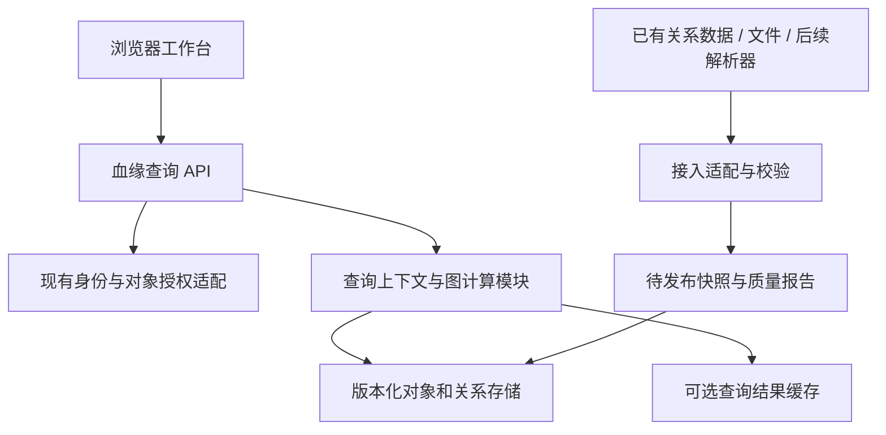

# 技术架构与数据接入

> v1.0 更新：本文保留产品/领域/架构与验收背景。已收敛的技术栈、环降级字段、数据导入页面、查询协议和默认决策统一以 [完整实现设计](07-implementation-design.md) 为准；接口字段以 `spec/v1/openapi.json` 为准。早期“待确认”条目不阻止按明确默认值完成本地编码，真实数据/SSO/目标环境仍需独立验收。

本文给出逻辑架构和有条件的选型，尚未确认技术栈、部署环境及已有平台能力。

## 1. 推荐系统边界

V1 推荐模块化单体后端配独立前端；接入耗时较长时独立工作进程。先用清楚的模块接口隔离解析、图计算、权限和 API，不因为“图”就引入一套微服务或图数据库。

## 2. 模块职责

| 模块 | 负责 | 输出 |
|---|---|---|
| CatalogAdapter | 将现有系统标识和字段映射为统一对象/关系 | 标准输入批次 |
| SnapshotService | 校验、版本、发布及失败回滚 | 不可变快照引用 |
| AuthorizationAdapter | 根、对象、字段及证据权限 | 授权对象/字段集合 |
| GraphQueryService | 可达、环检测、主父分类、最短路径和统计 | 固定版本的查询上下文 |
| ProjectionService | 按层级、类型、展开和预算构建返回子图 | 视图 DTO、游标和聚合 |
| FrontendState | 路由、上下文、异步请求、展开集合和选择 | 一致可恢复的工作状态 |
| GraphRenderer | 坐标布局、卡片、边、聚合和高亮 | 当前可见图；不重新决定主父 |

前端可以计算坐标与临时高亮，不能在懒加载片段上重做领域血缘分类。

## 3. 技术候选与决定方法

前端优先沿用团队现有 Vue 或 React，以 TypeScript 固定 DTO；图引擎通过适配层接入。已有 React 团队可优先验证 React Flow；更重视组合节点和 Canvas 图交互时可验证 G6。官方文档分别提供隐藏节点/减少渲染更新建议与节点/Combo 展开收起能力；这些仅证明功能存在，不证明本项目性能达标。[React Flow 性能文档](https://reactflow.dev/learn/advanced-use/performance)、[G6 展开收起文档](https://g6.antv.antgroup.com/manual/behavior/collapse-expand)

选型验证只选一个首选候选，用真实高扇出/汇合样本验证：双类型关系、跨支定位、局部展开时画布稳定性、长名称、100 个实际可见对象、200 个可见对象预算上限、离线资源和键盘替代操作。没有具体结果前不以星标数或示例截图决定。

后端语言沿用现有平台。若团队为 Java 体系，图算法用纯业务模块并与 HTTP 层隔离；若团队偏 TypeScript，也保持同样接口。不在本轮指定 JDK、框架或库版本，因为这些约束尚未提供。

存储可先复用已批准的关系数据库，通过对象表和有向关系表提供邻接索引。全库规模、更新频率和查询分布未明确，不应仅凭单表 500 节点就决定图数据库。若后续大规模多跳查询在既定预算下无法满足，再用相同输入和正确性用例比较替代方案。

## 4. 逻辑数据表（建议，不是可执行 DDL）

| 实体 | 主要字段与约束 |
|---|---|
| data_source | sourceId、环境、类型、名称、覆盖范围；连接凭据仅存引用 |
| object_identity | objectId、namespace、sourceStableId；来源身份唯一 |
| object_version | snapshotId、objectId、类型、名称、负责人、系统、生命周期；联合唯一 |
| relation_version | snapshotId、relationId、sourceId、targetId、rel、sourceOrderKey；端点可解析 |
| relation_evidence | relationId、snapshotId、证据定位、采集方法和时间、审核状态；敏感内容可只保存指针 |
| ingestion_run | runId、来源、状态、起止时间、输入摘要、错误和覆盖计数 |
| snapshot | snapshotId、来源版本集合、coverage、publishedAt、status、算法兼容版本 |
| quality_issue | runId、对象/关系引用、问题码、严重度、处理状态 |

关键索引：关系 `(snapshotId, sourceId)` 与 `(snapshotId, targetId)`；对象 `(snapshotId, type, namespace)`；受控名称检索索引。避免每次打开根都全表扫描。queryContext 可短期存在缓存或服务端内存，失效后客户端明确重新查询。

## 5. 接入模式与一期范围

**模式 A：已有关系数据（暂定主方案）。** 用户提供真实字段样本和来源语义；实现一个适配器，完成身份去重、边方向映射、缺失端点报告及定期快照。已有上游平台如能提供同版本分页 API，也可按协议读取，不强制重复存储全部事实。

**模式 B：文件导入。** 对象与关系分文件/分数组输入。批次至少声明来源、环境、版本/时间、全量或增量、覆盖范围。校验完先进入 staging，再原子发布。重复提交同批次 hash 幂等；失败不覆盖上一可用快照。增量删除必须有明确删除记录，不能把“本次没出现”当删除。

**模式 C：源码/数据库自动采集。** 单独建设数据库元数据读取、SQL/存储过程解析、Java 调用/SQL 使用分析。动态 SQL、反射、配置注入、远程调用、不支持方言等记录 unresolved/unknown，不能虚构确定关系。以真实源材料人工确认的小样本测精度和覆盖；采集方报告没有关系与不支持解析必须区分。周期和工作量需按具体语言方言重估。

无论哪种模式，地图 V1 的服务接口保持一致。展示前端可先对固定样本开发，但实际数据接入是交付依赖，不得用 mock 代替最终验收。

## 6. 快照、并发与更新

接入状态：RECEIVED → VALIDATING → READY → PUBLISHED，失败为 FAILED；发布只切换 activeSnapshot 指针。多来源必须记录 sourceVersionMap 与各自时间，不把异步采集包装成同一时刻的完整事实。

用户打开根后固定 snapshotId，所有视图、搜索定位、分页和路径使用同一上下文。新数据到达提示“有新版本可刷新”，不在展开过程中自动换版本。手动刷新创建新上下文，清空旧游标，选中对象仍存在且可见才恢复。

同批次重试幂等；并发发布用版本比较或同等互斥；发布失败保留上一版本。快照保留期、数据新鲜度 SLA、对历史版本访问规则待确认。

## 7. 权限与部署

V1 先接现有登录与对象授权，不默认建设多租户产品。若实际需要租户，租户 ID 必须进入每个身份、快照、查询和缓存键，不能作为事后 UI 筛选补丁。

缓存键至少覆盖根、快照、算法版本、Java 终点策略、授权范围指纹与授权版本；每次取缓存仍验证登录和授权有效性。权限变更使旧查询失效。节点、边、计数、搜索、清单、路径、证据和未来导出都在服务端过滤。

URL 不包含凭据、证据内容或 SQL；错误日志记录 requestId 和错误码，避免写入完整敏感代码。分享只是授权后复现查询，不自动扩大访问。

如果要求内网离线：构建产物、字体、图标、JS/CSS 全部本地提供；验证断网打开、目标浏览器兼容与代理路径。本轮末尾 Open Design 修订已移除 Google Fonts 并附完整 CSS，见 `reference/offline-style-update`；这是源码确认，完整产品仍需断网运行验收。部署可为静态前端+API+现有数据库，按环境决定容器或传统进程；不擅自新增基础设施。

## 8. 可运维性

记录接入成功率、快照年龄、未解析关系数、查询完整率、环查询数、API 分位耗时、超预算次数、前端绘制耗时与渲染错误。健康检查区分进程存活与依赖可用。上线前演练一次导入失败保留旧快照和权限撤销失效；日志能通过 requestId 串联查询与接入版本。
