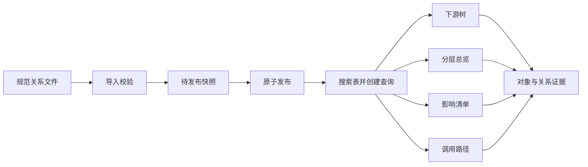

# 程序血缘地图 · 完整实现设计 v1.0

日期：2026-09-14。交付性质：设计基线与编码规格，尚未实施。用户已明确以现有原型完成设计并参考开源项目；以下技术默认值由本轮设计收敛，不冒称为用户提供的环境事实。

## 1. 决策与权威顺序

产品为独立的“表的下游关系探索工作台”。保留表/视图/存储过程/Java、主树实线与跨支虚线、四视图；Java 仅在展示查询中停止展开。V1 交付数据导入到页面查询的完整闭环，自动源码解析留在适配器后续阶段。

编码权威顺序：用户当前明确约束 → 本文决策与语义不变量 → `spec/v1/openapi.json` / `import.schema.json` 的字段 → `fixtures/v1` 的指定样例 → `docs/01` 的产品流程和 `docs/05` 的验收场景 → 原型视觉。字段和语义冲突时先修订规格并记录，不挑一个容易实现的版本。`docs/04` 的旧增量 children 协议被本文替代，Open Design 交接包只作为保留参考。

| 决策 | v1.0 默认值 | 依据/取舍 |
|---|---|---|
| 应用形态 | 前后端分离、后端模块化单体 | 当前是聚焦工作台，无需整套数据目录和分布式中间件 |
| 前端 | React + TypeScript + Vite；React Flow 开源核心 | 参考 DataHub/React Flow 的交互模式；卡片内容和详情组件复用 |
| 图布局 | 自有确定性分列布局，受控坐标；V1 不引入 ELK | 严格保留 layoutRank；减少额外布局层改变层级的风险 |
| 后端 | Java 21 + Spring Boot 4.1.x、Spring MVC、JDBC、Flyway、Maven Wrapper | 可将纯 Java 图算法与 HTTP/数据库分离；4.1 官方当前系统要求兼容 Java 21 |
| 数据库 | PostgreSQL 17 的受支持小版本 | 邻接查询与不可变快照可用普通关系表实现，无需先引入图数据库 |
| 会话 | 同源 BFF + OIDC 登录、服务端 HttpOnly Session | 浏览器不保存长期令牌；来源为现有身份提供方 |
| 缓存 | 单实例有界内存查询缓存，空闲 15 分钟、最大生存 60 分钟 | 不依赖 Redis；扩容另行引入共享上下文或会话路由 |
| 接入 | 一次完整 scope 的规范 JSON 全量导入；导入校验后显式发布 | 来源未知时能先完成独立闭环；快照语义简单可验收 |
| Java 粒度 | 默认 class，输入明确 javaKind；job/service 可显示但分开说明 | 不把不同粒度的数量当相同“类数” |
| 环 | 主树/按层总览降级；清单、关系和 BFS 路径可用 | 保留事实，不让图引擎反转语义边制造假树 |
| 授权 | 单组织、scope 级允许 + 对象 allow/deny；deny 优先 | 具备对象边界而不预建多租户产品 |

开发启动固定实际依赖发行版、lockfile、Maven BOM 和镜像摘要，不使用浮动 latest。当前未安装依赖，因此“4.1.x”等是版本线，不是已测试依赖锁。Spring Boot 官方系统要求与 PostgreSQL 支持周期已核对：[Spring Boot](https://docs.spring.io/spring-boot/system-requirements.html)、[PostgreSQL](https://www.postgresql.org/support/versioning/)。ELK 的 cycle breaking 会决定反转边用于布局，不能用它代替事实环处理：[ELK 说明](https://eclipse.dev/elk/reference/options/org-eclipse-elk-layered-cycleBreaking-strategy.html)。

## 2. 开源参考落实到哪些模块

完整证据见 [开源研究](06-opensource-research.md)及固定提交清单。没有复制第三方产品业务源码。

| 参考 | 本项目落点 |
|---|---|
| DataHub Explorer / Impact Analysis | GraphWorkspace 与 ImpactView 分开，计数来自完整查询而不是画布 |
| OpenMetadata 展开、分页、边详情 | ChildPicker、RelationDrawer、EvidencePanel，边证据可追溯 |
| OpenLineage 的 Dataset/Job/Run 区分 | SourceAdapter 保留来源版本与运行 ID 的证据引用；不把 parent Run 当 Java calls |
| Marquez 的 Job↔Dataset 模型 | 接入方向映射参考；不用其共享 I/O 相关查询冒充严格下游 |
| React Flow 开源核心 | 自定义节点/边、缩放、选中、MiniMap；自研展开状态与布局 |
| G6 | 可替代图引擎的接口边界；只有代表样本实测不足才启动切换评估 |

React Flow Pro 的展开/折叠示例不是本项目依赖；自行按本规格实现。开源组件版本冻结后保留 LICENSE/NOTICE 与依赖清单，不从收费示例复制 hook。

## 3. 功能与页面完整闭环



导航只有“血缘工作台”和有 ingest 权限才出现的“数据导入”。导入页面有批次上传、状态、问题分页、覆盖提示和发布按钮。V1 不提供关系手工编辑、采集连接器管理、风险自动判断和审批引擎。查询全范围表示**当前权限、当前快照、Java 终点规则内**的潜在关系，不表示对线上运行行为作保证。

数据导入任务由用户确认文件后提交，失败保留上一已发布快照；导入成功不自动发布。应用内的发布按钮是数据版本切换，不是本站代码部署。批次 sourceVersion/coverage 是来源声明，UI 显示“来源声明完整”等文字，不能据此声称采集器已被独立证明无漏报。

## 4. 数据模型与导入规则

字段以 [导入 Schema](../spec/v1/import.schema.json)为准；存储设计见 [storage.sql](../spec/v1/storage.sql)。SQL 为待实装迁移草案，本轮未在数据库执行。

一个 scope 是一个完整可查询目录边界，可包含多个系统/数据库；V1 不允许边跨 scope，不拼接各 scope 不同时间快照。多来源适配器先形成一致批次或把 coverage 标 partial/unknown，再提交。

对象 id 由来源适配器生成并持久化，命名空间必须含环境。身份重命名映射归适配器负责；V1 importer 不凭名称自动合并。Java 必须有 javaKind，非 Java 必须为 null；不同来源的同名对象是不同对象。

导入按以下顺序校验：JSON Schema→对象/关系/证据 ID 唯一→端点存在→证据引用存在→Java 类型条件→关系逻辑唯一→来源 scope 身份一致。任一结构错误或悬空端点导致批次 failed；来源未知的引用应在适配器质量报告中呈现，并降低 coverage，不能往正式对象表伪造节点。自环、事实环、Java 出边允许保存，但记 warning；展示查询决定它们如何参与。

同一批次 key+相同规范化内容摘要返回同一 runId；同 key 不同内容返回 IMPORT_INVALID。摘要包括完整 JSON 规范排序和原有数组顺序，不用于对象/边业务去重。相同 source/target/rel 若来自多个证据，适配器合并为同一 relationId 的 evidenceIds；关系 sourceOrder 为稳定非负整数，同源并列时使用；没有来源优先级时为 0，再按 relationId 决胜。

入库采用 JDBC 批写 staging 版本，批次失败保留问题记录且不能设为 published；原子发布事务锁定 scope 行，校验 expectedActiveSnapshotId，再切 active_snapshot_id、revision 和 published_at。比较冲突返回 PUBLISH_CONFLICT；仅当前成功发布的快照供默认查询。旧快照保持只读，明确保留期前不自动清理。

## 5. 领域算法与确定性

图算法仅存在后端 `domain/graph`，不依赖 Spring、JDBC 或图渲染库。

```text
query(snapshot, principal, seed):
  permitted = 授权对象与两端均获授权的关系
  usable = permitted 去掉 Java 出边和自环
  reach, minHops = BFS(seed, usable)
  若预算耗尽：返回 incomplete，不对局部图宣布完整分类
  edges = usable 两端都在 reach 的关系
  若有环：treeStatus=unavailable_cycle；保存 reach/edges 供清单和路径
  否则：按稳定拓扑顺序计算 rank
    对节点各入边比较：父 rank+1 降序、关系强度降序、sourceOrder 升序、relationId 升序
    选一条 parentEdge；根 rank=0，无父
    tree = 所有 parentEdge 的 relationId；cross = edges 去掉 tree
  stats = 完整 reach 去根的去重计数
```

强度沿用 writes=3、derives=2、calls=1、reads=0；仅布局并列决胜。排序以 Unicode 码点/ASCII ID 的固定比较实现，不调用依赖系统语言的 localeCompare。`children` 按 objectType 固定序 table/view/procedure/java，再 technicalName、objectId 排序。稳定拓扑队列按 objectId 排序。

BFS 最短路径先按 sourceOrder、relationId 排序出边，visited 防环；found 时 edges 数必须为 nodes 数−1，每条边方向与相邻对象匹配。Java 出边不参与，最长返回 256 个对象，超过返回 unknown/PATH_LENGTH_LIMIT。有环时路径边 kind=unclassified，不能伪称主边或跨支。

环查询无主树分类，crossEdges、layoutRank、parentEdgeId、treeChildCount、crossCount 为 null；对象清单仍含 minHops，overview 按类型聚合且 layoutRank=null。UI 文案“检测到循环依赖，已切换关系清单”；路径和全部关系明细仍可查看。

完整计算与来源完整性分开：来源 partial/unknown 时统计已知可达数用 lower_bound，并注明“已知对象”；来源 complete 且计算 complete 时 countStatus=exact，限定为来源声明范围。有环仅影响 tree 相关字段，不否定已经完整计算的 reachable 数量。

## 6. 查询与投影协议

[OpenAPI](../spec/v1/openapi.json)定义 14 个路径。这里明确 schema 无法表达的关系约束。

**查询上下文。** 创建时固定 snapshot、seed、principal 身份、授权版本、算法版本、reach/edges 和分类。搜索、详情、路径、分页均重新验证当前会话和授权版本；上下文只允许本人会话使用。新快照不会改变已建立查询。

**子节点接口。** GET children 只返回主树直接子对象的一个稳定分页，不再返回画布增量边。分页结果放缓存，未必立即画出。不同 parent 的请求可并发。

**投影接口。** 前端把计划显示的 candidateIds（最大 200，必须含根）、selectedId、types 和 revealSelectedPath 发给 projection。服务端在授权 reach 中验证 ID；至少一类开启时根保留；全关返回空 nodes/edges；筛选只裁剪呈现，不更改 parent。普通投影不自动补被类型隐藏的中间节点；revealSelectedPath=true 时为选中对象补齐主路径，允许展示必要类型并返回 PATH_REQUIRES_HIDDEN_TYPES 提示。

节点集确定后，返回该集内**所有合法关系**，每条 kind 使用固定查询分类，response 为完整替换，不与旧画布边做 append 合并。candidateIds 内不合法 ID 统一 NOT_FOUND；调用者不能借此探测无权限对象。超过 200 对象（包括 reveal 补齐）或 2000 条关系时返回 PROJECTION_LIMIT，不返回随机子集；前端保留上一合法画布并提供减少展开/转清单动作。

同一 (queryId,revision) 响应最多应用一次；任何 qid 或 revision 落后响应不写 UI。A、B 子节点先后到达时前端更新候选集合再请求新 revision 的完整投影。因此最终显示集合相同则最终边集合相同。

“全部”走 overview，簇只显示 count，不画无具体端点的对象连线；簇成员列表分页查看，定位具体对象才申请投影。影响清单独立分页查询完整 reach，不受候选集合/层级影响。路径独立查询；没有证据的推断只按其原状态展示，不升级成 confirmed。

## 7. 前端组件、状态和布局

组件分为 AppShell、TableSearch、QueryContextBar、ViewTabs、FilterBar、GraphWorkspace、ObjectNode、LineageEdge、ChildPicker、OverviewView、ImpactView、PathView、NodeInspector、RelationDrawer、EvidencePanel、ImportPage 和状态组件。React Flow 配置 nodesDraggable=false、nodesConnectable=false、edgesReconnectable=false，仅允许选择、平移、缩放；详细属性名按锁定版本类型校验。

服务端缓存用 TanStack Query，页面会话使用局部 reducer；V1 不额外引入全局状态框架。Reducer 维护 queryId、mode、types、selectedId、candidateIds、每 parent 已加载页、selected reveal pin、revision 和 viewport。Reducer 变化驱动投影，不在多个 effect 内分别变更节点/边。连线与节点作为一次提交写入受控图。

折叠时重新从根、保留的展开页和显式定位 pin 推导 candidateIds；被其他有效展开或 pin 需要的对象保留。节点缓存不必删除，但画布引用必须随投影替换。换根清空页与 pin，取消旧请求并重新创建上下文；切换模式不清空查询。

列布局默认卡片宽 248px、高 76px；x=layoutRank×352px，y 按该列稳定序排列，行间距 28px。相邻列主父对象作为排序分组，再按固定名称/ID；相同投影输入得到相同坐标。布局只在对象集合/尺寸变化时重算，选中高亮不重排。重新布局记录选中对象旧屏幕中心，完成后调整 viewport 保持锚点；首次/换根 fitView，单纯展开不反复 fitView。

边以 relationId 为 key。相邻列主边使用平滑连线；跳列跨支走画布上方保留路由通道，端点带箭头，平行关系按 relationId 有固定偏移。通道可以分组复用，但 hover/选中必须区分关系，并在详情列出所有 rel。不得把重叠关系当一条而丢计数。滚动/缩放不触发领域重新计算。先满足可读性基线，若 200 卡片密集场景无法读清则默认缩减绘制预算，不擅自丢边。

保留原型视觉 token 与内网更新 CSS，重构为组件样式；对名称使用文本插值，图引擎 ID 与 DOM/CSS 选择器解耦。详情证据 sourceRef 默认只显示可复制文本，不渲染任意 HTML 或自动访问未知 URL。

## 8. 安全、部署与运行约束

同源反向代理提供静态前端和 `/api`；服务端完成 OIDC Authorization Code 登录，session cookie HttpOnly/Secure/SameSite=Lax，用户信息仅来自校验后的身份。导入和发布必须 ingest 权限与 CSRF token；只读查询 POST 检查同源 Origin。生产不接受 dev 身份头或明文固定账号。

scope view 允许看整个 scope；object allow 可以单独允许对象；任何适用 deny 优先。未授权对象在遍历前移除，禁止经隐藏节点“跳接”。服务端授权版本在每次请求检查，版本变化返回 POLICY_CHANGED，前端销毁旧上下文。导入权限不隐含查询所有证据的权限；暂定证据继承关系两端可查看条件，若来源另有敏感字段权限则适配器过滤。

开发可有显式 dev profile，绑定 loopback、启动页标 DEMO，使用固定非生产 fixtures 和两组权限；production profile 未配置 OIDC、TLS 代理信任和授权映射时启动失败。身份系统接入未提供不影响本地实现，但必须标为生产验收未完成。

部署默认静态资源+单 API 实例+PostgreSQL；迁移在部署前独立运行，应用不自动修改 schema。备份数据库并演练恢复至上一 activeSnapshot；服务回滚不得执行 destructive down migration。资源本地打包、无外网字体/CDN依赖。配置只列名称，不把秘密写进仓库。

## 9. 预算与默认验证环境

| 项目 | 默认值/行为 |
|---|---|
| 单批次请求体 | 50 MiB；结构上限 10 万对象、50 万关系；先流式大小检查，再解析 |
| 单查询授权可达预算 | 1 万对象、5 万关系、计算 2 秒；任一超限标 incomplete |
| 缓存全局预算 | 256 MiB，LRU；单上下文估算最大 16 MiB，超出不缓存并返回受控限制 |
| 查询缓存生命周期 | 空闲 15 分钟、绝对 60 分钟，过期 410 |
| 子节点/清单页 | 默认 50，最大 100；搜索默认 10，最大 20 |
| 画布默认/上限 | 默认目标 100 对象，上限 200 对象、2000 关系 |
| API 并发验证 | 默认 10 个并发读用户，真实生产并发另验 |
| 基准设备 | 开发基准记录 CPU/内存/浏览器和数据库位置；目标内网环境需独立复测 |

这些是编码的保护默认值与测试目标，不是本轮性能成绩。默认首层取根及最多 99 个稳定排序子对象；详情 childCount 给总数。无效/超大导入返回 413/PAYLOAD_TOO_LARGE 或结构错误，不生成成功 run。超预算查询不能宣称“无路径”；可报告已知清单但图及最短路径状态保持 unknown。

监控：导入耗时/错误、快照年龄、query 完整率、API p95、projection 限制次数、缓存淘汰、客户端布局/渲染耗时、旧响应丢弃次数。日志以 requestId、queryId 和版本串联，不记录完整敏感证据。

## 10. 发布条件与外部前提

本地实现完成：真实 HTTP+真实临时数据库路径跑通、规范 fixtures 与反例通过、四视图 UI/并发/权限场景通过、资源可离线加载。真实试点完成还需至少一份用户真实关系样本逐边确认及目标环境性能、SSO/权限、备份恢复验证。

外部尚缺数据只影响“真实接入完成”结论，不能替代成演示已验收；也不应阻止先完成 importer、工作台和后端的本地编码。源码自动解析、跨 scope 合成、SCC 组内可视化、多实例和历史 diff 作为明确后续需求，不在 V1 偷偷扩展。
