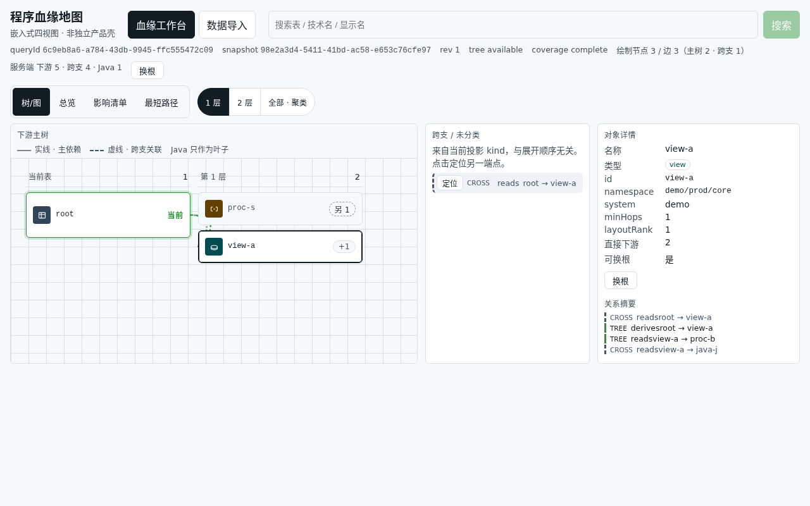
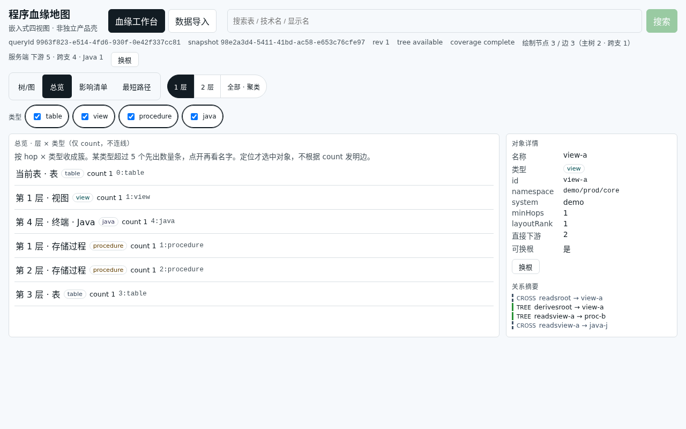
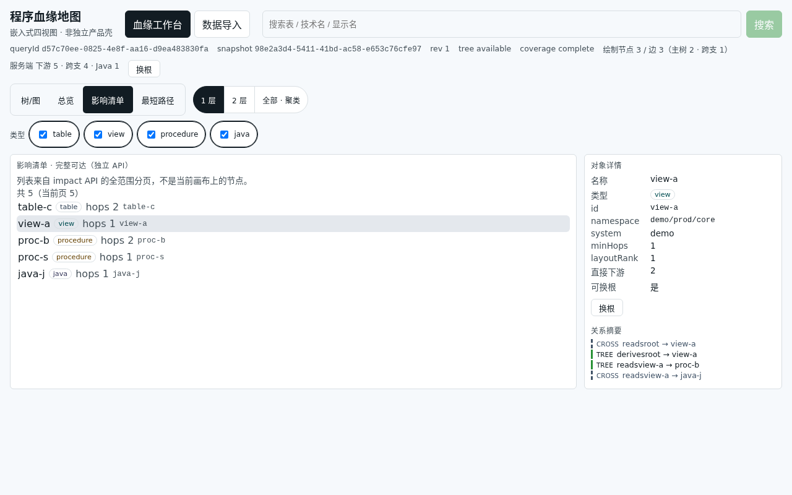
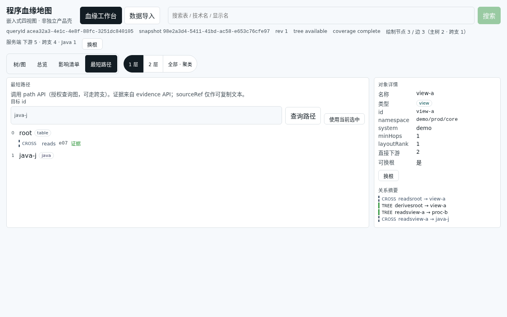

# DatabaseRelationMap 自动化测试报告

| 项 | 值 |
|---|---|
| 日期 | 2026-09-15（Asia/Shanghai） |
| Commit | `8b1b779`（`main`，含 PR #22/#23 OpenDesign 桌面树） |
| 仓库 | https://github.com/A1ittle/DatabaseRelationMap |
| 执行人 | DRM开发 |
| 结论 | **本地自动化测试全绿**；UI **仅桌面 1280** 四视图截图（OpenDesign 列式树，无 390）。**生产 / SSO 仍 BLOCKED，不写「可上线」。** |

## 1. 环境

| 组件 | 版本 / 说明 |
|---|---|
| JDK | 1.8.0_504 |
| Maven | 3.9.9 |
| Node / vitest | vitest 1.6.1 |
| PostgreSQL | 17.11（`deploy/docker-compose.yml` 可销毁实例） |
| Flyway | schema V2 |
| API | `http://127.0.0.1:8080` |
| Web | `vite preview` `http://127.0.0.1:4173` |
| 截图 | Playwright + Chrome，`1280×800`，`deviceScaleFactor=1` |
| Fixture | 仅 `fixtures/v1/import.json`（seed=`root`，selected=`view-a`，path target=`java-j`） |

## 2. 命令与结果

| 套件 | 命令 | 结果 |
|---|---|---|
| Web unit | `cd apps/web && npm test -- --run` | **17 files / 71 tests PASS** |
| API unit+JDBC | 可销毁 PG → `cd apps/api && mvn test` | **9 classes / 59 tests PASS** |
| UI 截图 | `COPY_BEST=0 WEB_BASE=…:4173 npm run capture:p4-visual` | **4/4 桌面 PNG**（无 390） |

### 2.1 Web vitest

含 OpenDesign 相关：`depthFilter` / `columns` / `edgePath` / `nodeBadge` / `treePath` / `urlSnapshotRace` 等；合计 **71** 全绿。

### 2.2 API surefire

合计 **59**，Failures=0 Errors=0 Skipped=0（含 JDBC import/query + Flyway V2）。本地口令来自 `deploy/.env.example`，**非生产凭据**。

## 3. UI 截图（桌面 only · OpenDesign 列式树）

协议：`evidence/implementation/p4-visual/PROTOCOL.md`（已去掉 390 义务）。树视图为 hops 画布 + NodeCard + SVG 边（#22/#23）。

| 视图 | 桌面 1280×800 |
|---|---|
| tree |  |
| overview |  |
| impact |  |
| path |  |

边界：仅 fixture；`queryId` 不入 URL；不要求与原型拓扑像素级一致；**不提交移动端/390 图**。

## 4. 失败项

**无。**

## 5. 已知限制

- 生产 / SSO / 真实会话：**BLOCKED**
- 生产备份 · PITR：未验证
- E2E 点击展开 / 导入异常流：未纳入本次自动化
- 本报告相对初版 #21：已按 `8b1b779` 重截，去掉过时嵌套树与 390 截图

## 6. 产物

```text
evidence/implementation/auto-test-report-20260915/
  auto-test-report-20260915.md
  screenshots/{tree,overview,impact,path}-1280.png
```
